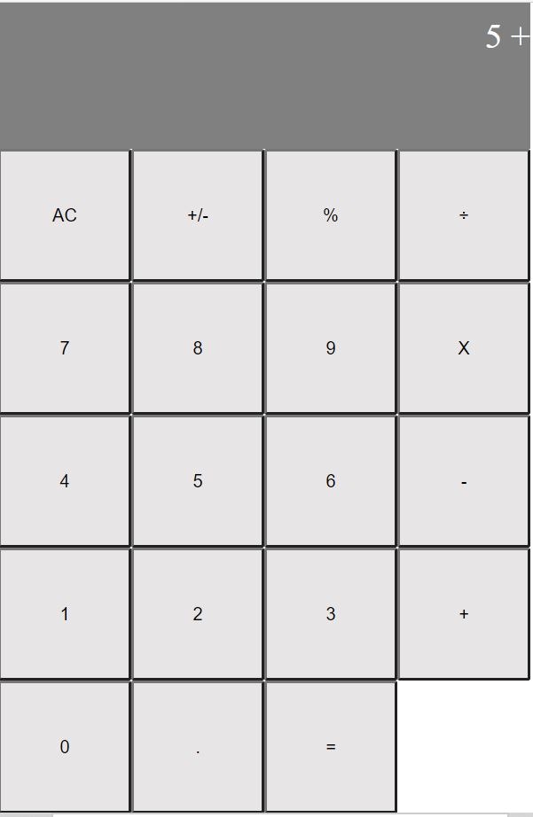

<h3 align="center">Calculator App</h3>

Calculator V1 app in React is a practice project, which includes manipulate dynamically the Virtual DOM and, use States and Props (useState Hook) to change information accordingly with the user interactions. In order to test the calculate method and React Components I use Jest and React Testing Library. Built with React, JavaScript, HTML5, CSS3, Bootstrap, Big.js and Prop-types.

## Live Link Demo

[Live Link Demo](https://nostalgic-hugle-6ba60c.netlify.app/)

## Built With

- React
- HTML5
- CSS3
- Bootstrap
- JavaScript
- Jest
- React Testing Library

## Getting Started

To get a local copy up and running follow these simple example steps.

### Prerequisites

- Text Editor (VSCode is suggested.)

### Setup

- Install [git](https://git-scm.com/downloads)
- Open Terminal
- Change directory to folder to download repository
- Use `cd <file-path>`
- Run `git clone https://github.com/imran5644/react-calculator-app.git`

To make any change,

- Open related file by using text editor.

## Usage
  - Run `npm start` on your terminal to open the server automatically on your browser
  - If it doesn't open automatically go to your browser and type the url `http://localhost:3000`
  - If you prefer to use the production minified JavaScript file run `npm run build` to create the build folder with the distribution files that can be served on your server.

## Test
  - Run `npm run test` to perform unit tests towards calculate.js file and, also tests if React components are being correctly rendered and all calculator methods are being performed as expected;

## Author

👤  **Imran Yousaf**

- GitHub: [@imran5644](https://github.com/imran5644)
- Twitter: [@imran56444](https://twitter.com/imran56444)
- LinkedIn: [Imran Yousaf](https://www.linkedin.com/in/imranyousaf-programmer/) 
## 🤝 Contributing

Contributions, issues and feature requests are welcome! Start by:

- Forking the project
- Cloning the project to your local machine
- `cd` into the project directory
- Run `git checkout -b your-branch-name`
- Make your contributions
- Push your branch up to your forked repository
- Open a Pull Request with a detailed description to the development branch of the original project for a review

## Show your support

Give a ⭐️ if you like this project!

## Acknowledgments

- React
- Bootstrap
- W3Schools
- Font Awesome
- Javascript
- Jest
- React Testing Library
- Regenerator Runtime

## 📝 License

This project is [MIT](LICENSE) licensed.